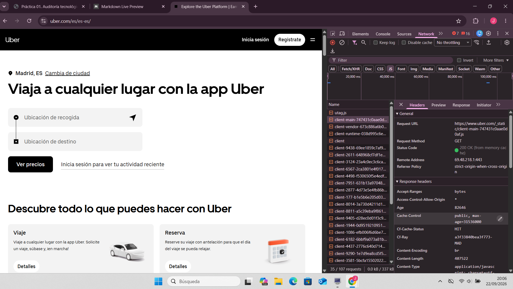
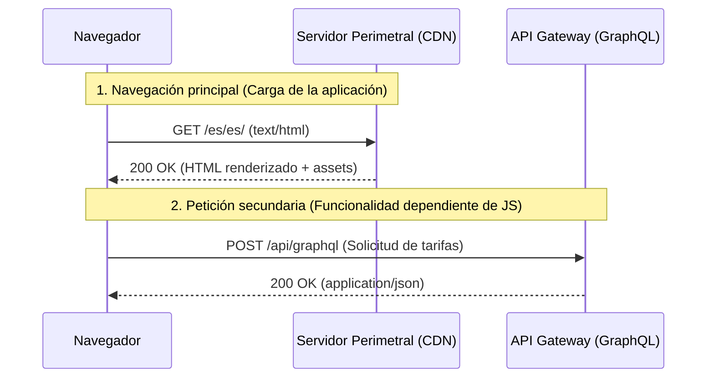
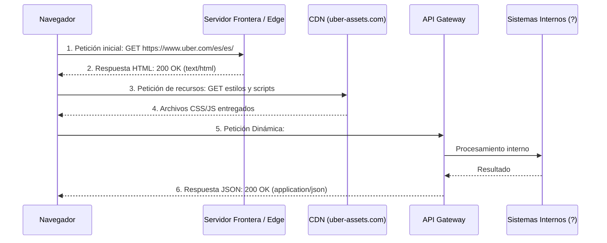
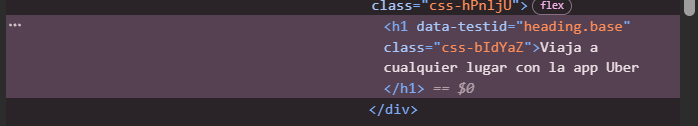
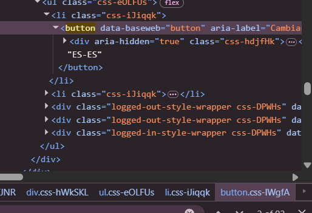
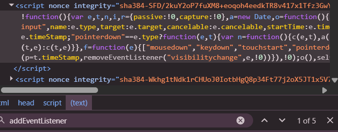
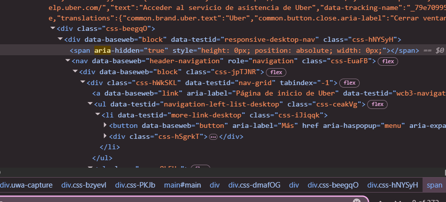
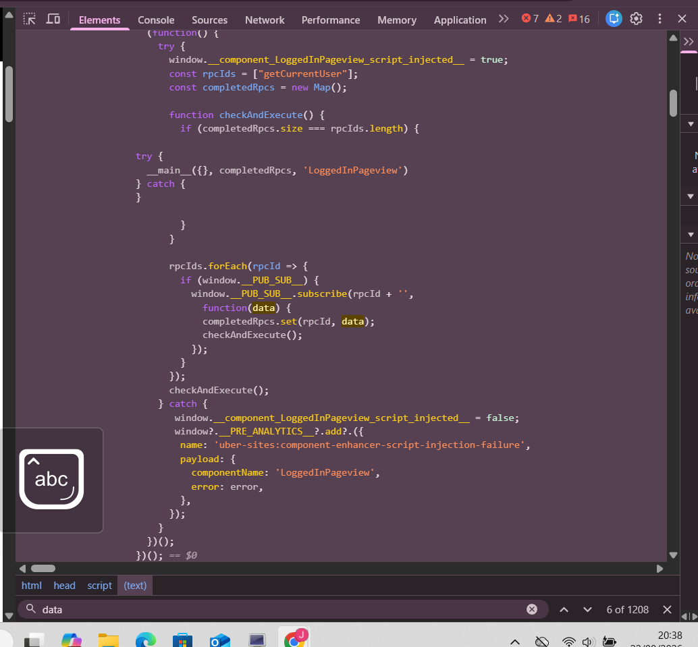

# Auditoría tecnóliga de una página web

## 1. Objetivo y Contexto 
El objetivo de este documento es analizar la arquitectura frontend, la red y la accesibilidad de una aplicación web moderna como uber en este caso y que contenga geolocaclización. El objetivo de esta actividad es analizar la arquitectura cliente/servidor de la página de uber en este caso.

## 2. Identificación del Entorno
* **Aplicación Auditada:** Uber, en su página de inicio
* **URL Base:** `https://www.uber.com/es/es/`
* **Fecha:** 21 de septiembre de 2026
* **Navegador:** Google Chrome
* **Versión:** Versión 153.0.8010.48

* 

## 3. Diagrama Cliente-Red-Servidor

## 4. Inventario de recursos
* **HTML:** Estructura base pre-renderizada (SSR).
* **CSS:** Estilos visuales cargados desde CDN.
* **JS:** Scripts de React para la interactividad.
* **XHR/Fetch:** Llamadas a la API para tarifas y mapas.
* **Medios:** Imágenes optimizadas y fuentes propias.

## 5. Análisis JS y Mejora progresiva

* **Geolocalización:** Si el usuario rechaza dar su ubicación, la web no da error y permite escribir la dirección a mano.

* **Integración HTML/JS:** JS se conecta al HTML limpiamente mediante atributos de datos, separando diseño y lógica.

* **Mejora progresiva:** Si desactivas JavaScript, la página se ve perfecta pero no puedes pedir viajes.

## 6. Pruebas y límites
**Accesibilidad de teclado**
* **Resultado:** Se puede usar el buscador de viajes usando solo `Tab`, `Flechas` y `Enter`.

**Simulación Offline**
* **Resultado:** Si cortas la red al buscar un viaje, la página se queda bugueada y se queda asi infinitamente.

## 7. Recomendación priorizada
Añadir un control de errores de red: si el usuario pierde conexión, quita la animación de "cargando" y mostrar un mensaje de error.

## 8. Conclusión y límites
Uber tiene un frontend muy bueno, accesible y bien estructurado, aunque falla al avisar de cortes de internet y al inspeccionar puedes ver varios errores del cliente como se puede ver arriba de la captura anterior. 
**Límites:** Al ser una auditoría desde el navegador, solo vemos el cliente. El backend y las bases de datos internas permanecen ocultas.

## Apartado A: Reconstrucción Cliente-Servidor

## Apartado B: La Geolocalización

* **¿Qué necesidad resuelve?**
  Resuelve la capacidad de ubicar al usuario para saber exactamente dónde recogerlo y a dónde enviar el pedido o transporte.

* **¿Cómo verifica que existe?**
  Uber verifica que la capacidad de ubicación está disponible en el navegador o la app del dispositivo. Antes de intentar obtener las coordenadas, comprueba su existencia; si no existe, evita ejecutar la acción para prevenir errores en la página.

* **¿Qué permiso o contexto requiere?**
  Requiere obligatoriamente ejecutarse sobre una capa de conexión segura (HTTPS). Además, necesita el consentimiento explícito del usuario, por lo que siempre lanza una alerta preguntando si permite el acceso a la ubicación.

* **¿Qué sucede si se deniega el permiso?**
  En caso de rechazar el acceso a la ubicación, Uber captura esa negativa para que no surja un error en el sistema. Automáticamente, adapta la interfaz para seguir funcionando con normalidad sin depender de las coordenadas automáticas.

* **¿Qué riesgo conlleva?**
  Supone un riesgo de privacidad bastante alto, ya que implica compartir la ubicación exacta y en tiempo real del usuario a través de la web.

* **¿Qué alternativa se ofrece?**
  Si el usuario rechaza el permiso de ubicación, la plataforma ofrece un campo de texto que permite introducir la dirección de recogida o poner un punto de entrega totalmente a mano.

## Apartado C: Lenguajes y scripts

**1. Responsabilidades observables**

* **HTML (Estructura):** Construye el esqueleto de la página, agrupando textos, botones y las cajas del formulario.

* **CSS (Presentación):** Aplica el diseño visual y adapta la estructura para que se vea correctamente en distintos dispositivos.

* **JavaScript (Interactividad):** Permite que el buscador autocomplete tu dirección mientras escribes y calcula la tarifa sin necesidad de recargar la página.

**2. Prueba sin JavaScript**

* **Interacción elegida:** Escribe una dirección para solicitar un viaje.

* **Resultado al bloquear JS:** La página carga su diseño con normalidad pero el formulario indica ubicaciones y el botón de búsqueda no responde.

**3. Clasificación**

* **Contenido conservado:** Puedes leer toda la información comercial y ver la interfaz, pero es imposible completar la acción principal (pedir un viaje).

**4. Evaluación**

* **Dependencia justificada:** Sí. Al ser una aplicación en tiempo real, Uber necesita conectar mapas, sugerencias de direcciones y precios dinámicos al instante, algo imposible solo con HTML.

* **Comunicación del error:** El código fuente incluye una etiqueta `<noscript>` diseñada para avisar al usuario que la plataforma no puede funcionar si JavaScript está desactivado.

## Apartado D: Marcas y Programación

* Elemento semántico adecuado: 
* Nombre accesible: 
* Operación con teclado: 
* Comunicación de cambios de estado: 
* Uso de atributos o clases como contrato de comportamiento: 
* Inserión segura de texto no confiable: 