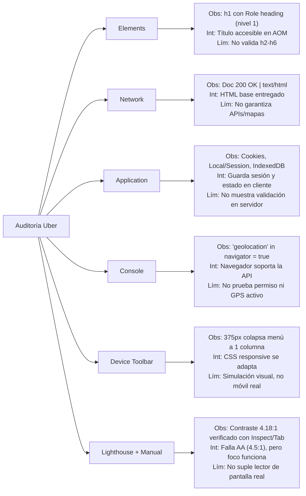

```mermaid
    flowchart LR
    A[Auditoría Uber] --> E[Elements]
    A --> N[Network]
    A --> AP[Application]
    A --> C[Console]
    A --> D[Device Toolbar]
    A --> L[Lighthouse + Manual]

    E --> E1["Obs: h1 con Role heading (nivel 1)<br/>Int: Título accesible en AOM<br/>Lím: No valida h2-h6"]
    N --> N1["Obs: Doc 200 OK | text/html<br/>Int: HTML base entregado<br/>Lím: No garantiza APIs/mapas"]
    AP --> AP1["Obs: Cookies, Local/Session, IndexedDB<br/>Int: Guarda sesión y estado en cliente<br/>Lím: No muestra validación en servidor"]
    C --> C1["Obs: 'geolocation' in navigator = true<br/>Int: Navegador soporta la API<br/>Lím: No prueba permiso ni GPS activo"]
    D --> D1["Obs: 375px colapsa menú a 1 columna<br/>Int: CSS responsive se adapta<br/>Lím: Simulación visual, no móvil real"]
    L --> L1["Obs: Contraste 4.18:1 verificado con Inspect/Tab<br/>Int: Falla AA (4.5:1), pero foco funciona<br/>Lím: No suple lector de pantalla real"]
```