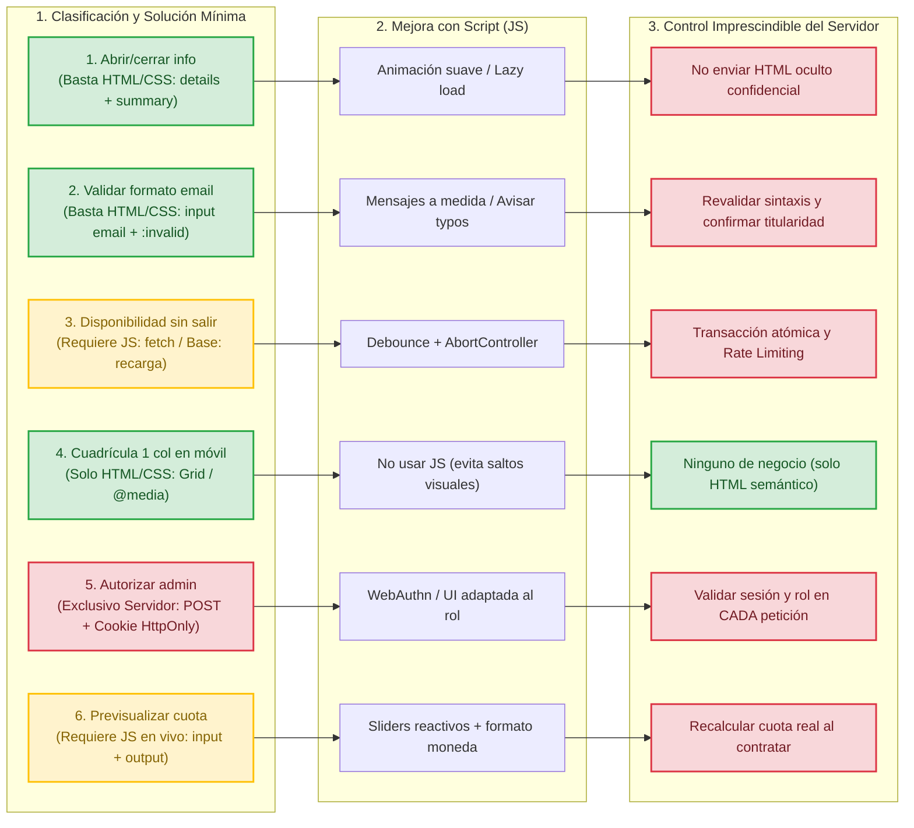

```mermaid
    flowchart LR
    classDef html fill:#d4edda,stroke:#28a745,color:#155724,stroke-width:2px
    classDef js fill:#fff3cd,stroke:#ffc107,color:#856404,stroke-width:2px
    classDef srv fill:#f8d7da,stroke:#dc3545,color:#721c24,stroke-width:2px

    subgraph C1["1. Clasificación y Solución Mínima"]
        F1["1. Abrir/cerrar info<br/>(Basta HTML/CSS: details + summary)"]:::html
        F2["2. Validar formato email<br/>(Basta HTML/CSS: input email + :invalid)"]:::html
        F3["3. Disponibilidad sin salir<br/>(Requiere JS: fetch / Base: recarga)"]:::js
        F4["4. Cuadrícula 1 col en móvil<br/>(Solo HTML/CSS: Grid / @media)"]:::html
        F5["5. Autorizar admin<br/>(Exclusivo Servidor: POST + Cookie HttpOnly)"]:::srv
        F6["6. Previsualizar cuota<br/>(Requiere JS en vivo: input + output)"]:::js
    end

    subgraph C2["2. Mejora con Script (JS)"]
        M1["Animación suave / Lazy load"]
        M2["Mensajes a medida / Avisar typos"]
        M3["Debounce + AbortController"]
        M4["No usar JS (evita saltos visuales)"]
        M5["WebAuthn / UI adaptada al rol"]
        M6["Sliders reactivos + formato moneda"]
    end

    subgraph C3["3. Control Imprescindible del Servidor"]
        S1["No enviar HTML oculto confidencial"]:::srv
        S2["Revalidar sintaxis y confirmar titularidad"]:::srv
        S3["Transacción atómica y Rate Limiting"]:::srv
        S4["Ninguno de negocio (solo HTML semántico)"]:::html
        S5["Validar sesión y rol en CADA petición"]:::srv
        S6["Recalcular cuota real al contratar"]:::srv
    end

    F1 --> M1 --> S1
    F2 --> M2 --> S2
    F3 --> M3 --> S3
    F4 --> M4 --> S4
    F5 --> M5 --> S5
    F6 --> M6 --> S6
```